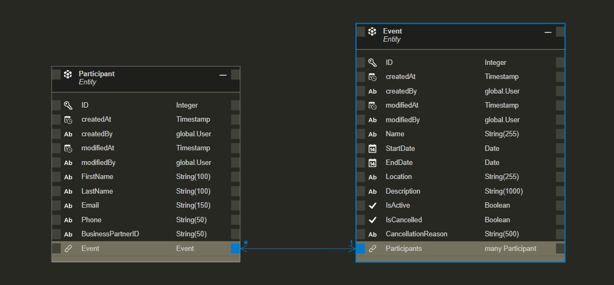

# API EVENTS MANAGER


Hay una [Versión en español](README_es.md) de este archivo.

This README provides an overview of the Event Tickets API, including instructions on how to use it, available routes, and details about its implementation.

This project is part of a *Deliverable for the SAP CAP Bootcamp at Globant.*

## Introduction

The deliverable involves delivering a project built with SAP CAP and deployed on Cloud Foundry.

The API allows for the management of events and users. It provides CRUD operations for each entity and includes a custom endpoint.

## Features

- Actions and functions were used depending on the requirement.
- Data was used from an external Business Partner API.
- Custom routes were created in addition to the ones provided by CAP.
- Validations were implemented for data entry.
- Custom endpoints implemented:
      registerParticipant
      getEventParticipants
      cancelEvent
      reopenEvent
      fetchParticipantDetails

## Requirements

    Node.js (v18 or higher)
    npm (v6 or higher)
    CAP Framework
    HANA Database

## How to Run the Application

Clone the repository:

```sh

git clone https://github.com/migmm/events-manager.git
cd events-manager
```

Install the dependencies:

```sh
npm install
```

Start the service:

```sh
cds watch --profile hybrid
```

You need to have HANA activated to load and work with the provided data tables.

## Deployment

For the extra logic, JavaScript was used with this.before and this.on.

An additional entity was created to store data from the API Business Partner.

The entities were separated from the services.

To make the code more readable, data entry verifications were performed using this.before.

Errors were modeled to be consistent with those returned by SAP CAP.

## Relationships Between Entities

The relationships between entities are: Event to Participant (1:N ) explicitly, and Participant to BusinessPartner implicitly, as it is a foreign key and is handled by CAP.



## Validations and Verifications

Validations were implemented at both the entity level and in the JavaScript code.
In the entities, the type, range, and format were validated.

Verifications were performed according to the requirements, e.g., whether the participant added to an event is added correctly. For this, the CAP after hook was used.

## Requests

Below are requests with working data, omitting requests that would generate error messages. These requests with erroneous data are included both in the [HTTP file](rest-client.http) and the [Postman collection](Event%20Management%20API.postman_collection.json) for testing purposes.

#### Base URL and port
```sh
@port=40037
@api_base_url = http://localhost:{{port}}/odata/v4/management/
```

#### Events
##### Get all events
```sh
GET {{api_base_url}}Events
Accept: application/json
```

##### Create a new event
```sh
POST {{api_base_url}}Events
Content-Type: application/json

{
  "Name": "Tech Conference 2024",
  "StartDate": "2024-07-01",
  "EndDate": "2024-07-03",
  "Location": "New York City",
  "Description": "Annual Technology Conference",
  "IsActive": true,
  "IsCancelled": false,
  "CancellationReason": null
}
```

##### Update an event
```sh
PATCH {{api_base_url}}Events(1)
Content-Type: application/json

{
  "Description": "Updated description for Tech Conference 2024"
}
```

##### Delete an event
```sh
DELETE {{api_base_url}}Events(1)
```

#### Participantes

##### Get all participants
```sh
GET {{api_base_url}}Participants
Accept: application/json
```

##### Create a participant
```sh
POST {{api_base_url}}Participants
Content-Type: application/json

{
  "FirstName": "John",
  "LastName": "Doe",
  "Email": "johndoe@xample.com",
  "Phone": "123456789",
  "BusinessPartnerID": "1000000"
}
```

##### Update a participant (BusinessPartnerID cannot be changed)
```sh
PATCH {{api_base_url}}Participants(1)
Content-Type: application/json

{
  "BusinessPartnerID": "987654321"
}
```

##### Delete a participant
```sh
DELETE {{api_base_url}}Participants(1)
```
    Custom logic

##### Fetch Participant Details
```sh
GET {{api_base_url}}fetchParticipantDetails(ParticipantID=2)
Accept: application/json

```

##### Register a participant for an event
```sh
POST {{api_base_url}}registerParticipant
Content-Type: application/json

{
  "eventID": 2,
  "participantID": 2
}
```

##### Cancel an event
```sh
POST {{api_base_url}}cancelEvent
Content-Type: application/json

{
  "eventID": 2,
  "reason": "Weather conditions"
}
```

##### Reopen an event
```sh
POST {{api_base_url}}reopenEvent
Content-Type: application/json

{
  "eventID": 2
}
```

##### Retrieve participants for a specific event
```sh
GET {{api_base_url}}getEventParticipants(eventID=2)
Accept: application/json
```

## Testing

To make testing easier, it was decided to *not include* authentication.

An [HTTP file](rest-client.http) was included for local and deployed testing in VS Code using the Rest Client extension, as well as a [Postman collection](Event%20Management%20API.postman_collection.json), including both correct and incorrect data.

To use the HTTP file locally or remotely, uncomment or comment line 14 as follows:

    Testing locally:
    ### @api_base_url = https://2fda7038trial-trial-spnpjyiq-events-man-event-managemen5a33b8dd.cfapps.us10-001.hana.ondemand.com/odata/v4/management/

    Testing the deployed API:
    @api_base_url = https://2fda7038trial-trial-spnpjyiq-events-man-event-managemen5a33b8dd.cfapps.us10-001.hana.ondemand.com/odata/v4/management/

## Messages

Error messages and success messages were formatted to match the standard CAP format.

- Error message formatted to the CAP standard

```sh
{
  "error": {
    "code": "404",
    "message": "Business Partner with ID 10000 does not exist.",
    "@Common.numericSeverity": 4
  }
}
```

##  Sources

https://community.sap.com/t5/technology-q-a/error-during-request-to-remote-service-failed-to-load-destination/qaq-p/13773565

https://api.sap.com/api/API_BUSINESS_PARTNER/resource/Business_Partner

https://developers.sap.com/tutorials/spa-consume-actions-cap-setupenv..html

https://cap.cloud.sap/docs/guides/using-services

https://community.sap.com/t5/technology-blogs-by-sap/understanding-entity-relationships-in-cds/ba-p/13552921

https://developers.sap.com/mission.hana-cloud-cap.html