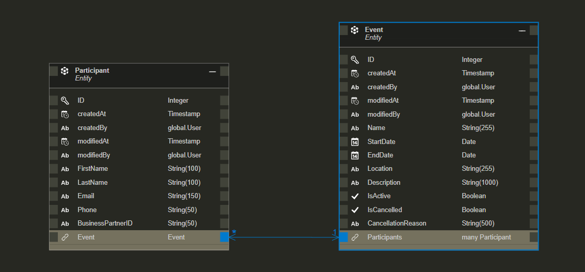

# API EVENTS MANAGER


There is an [English version](README.md) of this file.

Este README proporciona una visión general de la API de Tickets de Eventos, incluyendo instrucciones sobre cómo usarla, rutas disponibles y detalles sobre su implementación.

Este proyecto es parte del un *Entregable del Bootcamp SAP CAP de Globant.*

## Introducción

El entregable consiste en entregar un proyecto realizado en SAP CAP y deployado en Cloud Foundry de acuerdo a una serie de requerimientos.

La API permite la gestión de eventos y usuarios. Proporcionando operaciones CRUD para cada entidad e incluye endpoints personalizados para.

## Características

- Se hicieron uso de actins y functions dependiendo del requerimiento.
- Se uso información de una API externa de Business Partner.
- Se crearon rutas custom ademas de las proporcionadas por CAP.
- Se usaron validaciones en general para el ingreso de información.


## Requisitos

    Node.js (v18 o superior)
    npm (v6 o superior)
    CAP Framework
    Base de Datos HANA

## Cómo Ejecutar la aplicación

Clonar el repositorio:

```sh
git clone https://github.com/migmm/events-manager.git
cd events-manager
```

Instalar las dependencias:

```sh
npm install
```

Iniciar el servicio:

```sh
cds watch --profile hybrid
```

Necesitás tener HANA activado para cargar y trabajar con las tablas de datos proporcionada.

## Deploy

Para la lógica extra se realizó en Javscript usando this.before y this.on

Se creó una entidad extra con los datos del Api Business Partner

Se separaron las entidades de los servicios.

Para que el codigo quede mas claro de leer, las verificaciones de ingreso de datos se realizaron mediante un *this.before*

Los errores fueron modelados para ser uniformes con los que retorna SAP CAP

## Relaciones entre entidades

Las relaciones entre entidades es Evento a Participante 1:N explícitamente y Participante a BusinessPartner está determinada implícitamente, ya que es una clave foranea y está manejada por CAP.



## Validaciones y verificaciones

Se implementaron validaciones tanto a nivel entidad como en el codigo js. 
En las entidades se validaron el tipo que se inserta y el rango asi como el formato.

Las verificaciones se realziaron de acuerdo a lo requerido, ej: si el participante que se agrega a un evento se agrega correctamente. para eso se uso el hook *after* de CAP.

## Requests

A continuación se muestran los requests con datos que funcionan, omitiendo los request que generarían mensajes de error, estos request con datos erroneos están incluídos tanto en [archivo HTTP](rest-client.http) como en la [colección postman](Event%20Management%20API.postman_collection.json) para ser testeados.


#### URL base y puerto
```sh
@port=40037
@api_base_url = http://localhost:{{port}}/odata/v4/management/
```

#### Eventos
##### Get de todos los eventos
```sh
GET {{api_base_url}}Events
Accept: application/json
```

##### Crear nuevo evento
```sh
POST {{api_base_url}}Events
Content-Type: application/json

{
  "Name": "Tech Conference 2024",
  "StartDate": "2024-07-01",
  "EndDate": "2024-07-03",
  "Location": "New York City",
  "Description": "Annual Technology Conference",
  "IsActive": true,
  "IsCancelled": false,
  "CancellationReason": null
}
```

##### Actualizar un evento
```sh
PATCH {{api_base_url}}Events(1)
Content-Type: application/json

{
  "Description": "Updated description for Tech Conference 2024"
}
```

##### Eliminar un evento
```sh
DELETE {{api_base_url}}Events(1)
```

#### Participantes

##### Get de todos los participantes
```sh
GET {{api_base_url}}Participants
Accept: application/json
```

##### Crear participante
```sh
POST {{api_base_url}}Participants
Content-Type: application/json

{
  "FirstName": "John",
  "LastName": "Doe",
  "Email": "johndoe@xample.com",
  "Phone": "123456789",
  "BusinessPartnerID": "1000000"
}
```

##### Actualizar participante (BusinessPartnerID)
```sh
PATCH {{api_base_url}}Participants(1)
Content-Type: application/json

{
  "FirstName": "John",
  "LastName": "Doe",
  "Email": "johndoe@xaplsess.com",
  "Phone": "123456789",
  "BusinessPartnerID": "1000000"
}
```

##### Eliminar participante
```sh
DELETE {{api_base_url}}Participants(1)
```
    Custom logic

##### Get participante con business poartner incluido
```sh
GET {{api_base_url}}fetchParticipantDetails(ParticipantID=2)
Accept: application/json

```

##### Registrar participante a un evento
```sh
POST {{api_base_url}}registerParticipant
Content-Type: application/json

{
  "eventID": 2,
  "participantID": 2
}
```

##### Cancelar un evento
```sh
POST {{api_base_url}}cancelEvent
Content-Type: application/json

{
  "eventID": 2,
  "reason": "Weather conditions"
}
```

##### Reactivar un evento
```sh
POST {{api_base_url}}reopenEvent
Content-Type: application/json

{
  "eventID": 2
}
```

##### Ver los participantes inscriptos a un evento especifico
```sh
GET {{api_base_url}}getEventParticipants(eventID=2)
Accept: application/json
```

## Testing

Para hacer mas fácil el testeo se decidió ¨*no incluir* autenticación.

Se incluyó un [archivo HTTP](rest-client.http) para testear local y deployado en VScode con la extensión rest client y una [colección postman](Event%20Management%20API.postman_collection.json), incluyendo request tanto como ingresando datos correctos como también ingresando datos erroneos.

Para usar el archivo http de forma local o remota hay que comentar o descomentar la linea 14.

    así se hace el testeo en forma local
    ### @api_base_url = https://2fda7038trial-trial-spnpjyiq-events-man-event-managemen5a33b8dd.cfapps.us10-001.hana.ondemand.com/odata/v4/management/

    así se hace el testeo a la api deployada
    @api_base_url = https://2fda7038trial-trial-spnpjyiq-events-man-event-managemen5a33b8dd.cfapps.us10-001.hana.ondemand.com/odata/v4/management/

## Mensajes

Los mensajes de error como los de sucess fueron formateados igual al formato estandar de CAP.

- Mensaje de error adaptado al formato CAP

```sh
{
  "error": {
    "code": "404",
    "message": "Business Partner with ID 10000 does not exist.",
    "@Common.numericSeverity": 4
  }
}
```
## Fuentes

https://community.sap.com/t5/technology-q-a/error-during-request-to-remote-service-failed-to-load-destination/qaq-p/13773565
